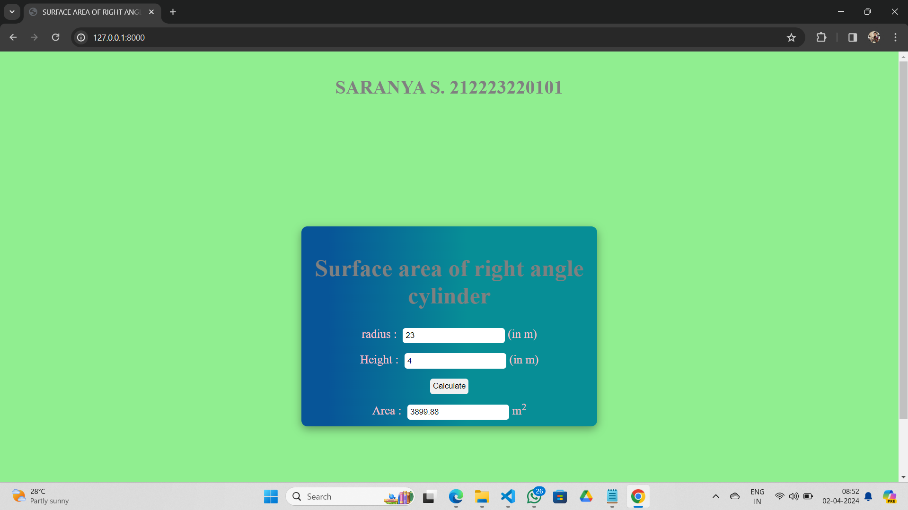

# Ex.05 Design a Website for Server Side Processing
## Date:02/04/2024

## AIM:
To design a website to find surface area of a Right Cylinder in server side.

## FORMULA:
Surface Area = 2Πrh + 2Πr<sup>2</sup>
<br>r --> Radius of Right Cylinder
<br>h --> Height of Right Cylinder

## DESIGN STEPS:

### Step 1:
Clone the repository from GitHub.

### Step 2:
Create Django Admin project.

### Step 3:
Create a New App under the Django Admin project.

### Step 4:
Create python programs for views and urls to perform server side processing.

### Step 5:
Create a HTML file to implement form based input and output.

### Step 6:
Publish the website in the given URL.

## PROGRAM :
```
<!DOCTYPE html>
<html lang="en">
<head>
    <meta charset='utf-8'>
    <meta http-equiv='X-UA-Compatible' content='IE=edge'>
    <title>SURFACE AREA OF RIGHT ANGLE CYLINDER</title>
    <h1 align="center">SARANYA S. 212223220101 </h1>
    <meta name='viewport' content='width=device-width, initial-scale=1'>
    <style type="text/css">
        body {
            background-color: lightgreen;
        }

        .edge {
            display: flex;
            height: 100vh;
            width: 100%;    
            justify-content: center;
            align-items: center;
        }

        .box {
            display: block;
            width: 500px;
            min-height: 300px;
            font-size: 20px;
            background: rgb(7,85,152);
            background: linear-gradient(90deg, rgba(7,85,152,1) 9%, rgba(7,142,150,1) 56%);
            border-radius: 10px;
            box-shadow: rgba(0, 0, 0, 0.35) 0px 5px 15px;
        }

        .formelt {
            color: pink;
            text-align: center;
            margin-top: 7px;
            margin-bottom: 6px;
        }

        h1 {
            color: gray;
            text-align: center;
            padding-top: 20px;
        }

        input {
            margin: 5px;
            padding: 5px;
            border-radius: 5px;
            border: none;
        }
    </style>
</head>
<body>
    <div class="edge">
        <div class="box">
            <h1>Surface area of right angle cylinder</h1>
            <form method="POST">
                
                <div class="formelt">
                    radius : <input type="text" name="radius" value="{{r}}"></input>(in m)<br />
                </div>
                <div class="formelt">
                    Height : <input type="text" name="height" value="{{h}}"></input>(in m)<br />
                </div>
                <div class="formelt">
                    <input type="submit" value="Calculate"></input><br />
                </div>
                <div class="formelt">
                    Area : <input type="text" name="area" value="{{area}}"></input>m<sup>2</sup><br />
                </div>
            </form>
        </div>
    </div>
</body>
</html>


from django.shortcuts import render

def cylinderarea(request):
    context = {}
    context['area'] = "0"
    context['r'] = "0"
    context['h'] = "0"
    
    if request.method == 'POST':
        print("POST method is used")
        r = request.POST.get('radius', '0')  # Corrected key to retrieve radius
        h = request.POST.get('height', '0')  # Corrected key to retrieve height
        print('request =', request)
        print('radius =', r)
        print('height =', h)
        
        area = 2 * 3.14 * int(r) * int(h) + (2 * 3.14 * int(r) * int(r))
        context['area'] = area
        context['r'] = r
        context['h'] = h
        print('Area =', area)
    
    return render(request, 'mathapp/math.html', context)


    from django.contrib import admin
from django.urls import path
from mathapp import views
urlpatterns = [
    path('admin/', admin.site.urls),
    path('areaofcylinder/',views.cylinderarea,name="areaofcylinder"),
    path('',views.cylinderarea,name="areaofcylinderroot")
]


```

## SERVER SIDE PROCESSING:


## HOMEPAGE:


## RESULT:
The program for performing server side processing is completed successfully.
